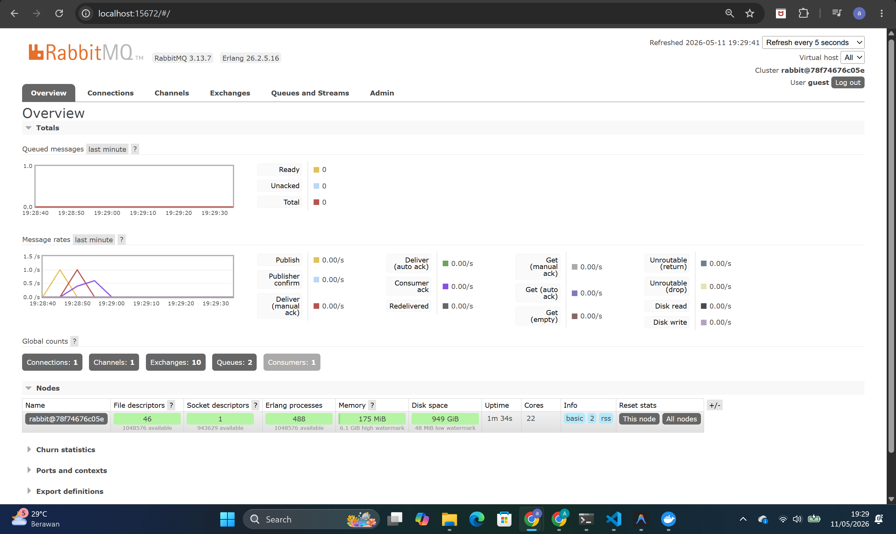
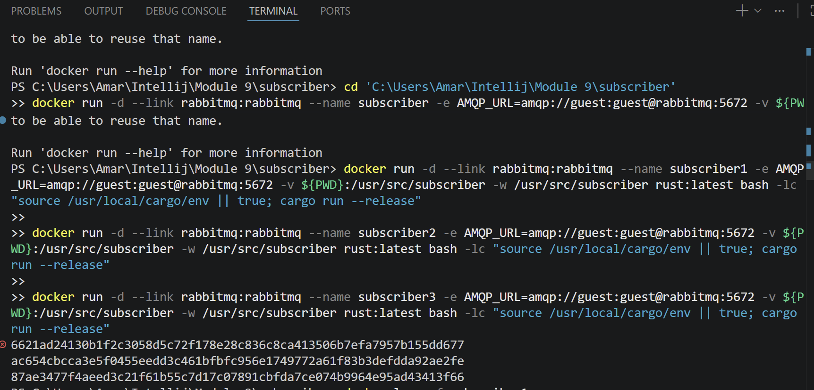
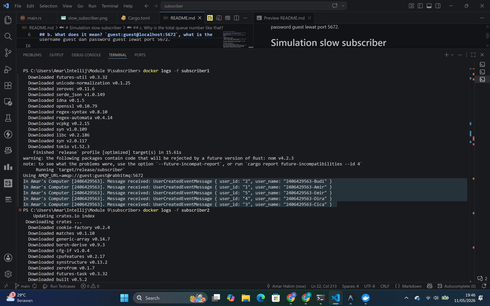
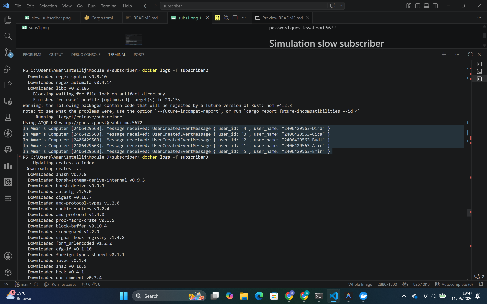
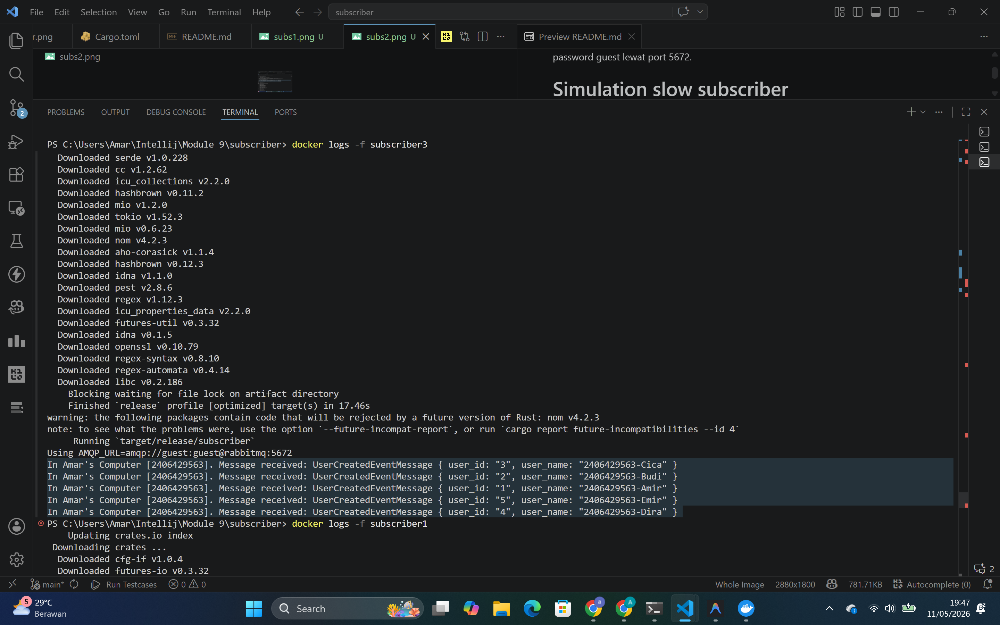
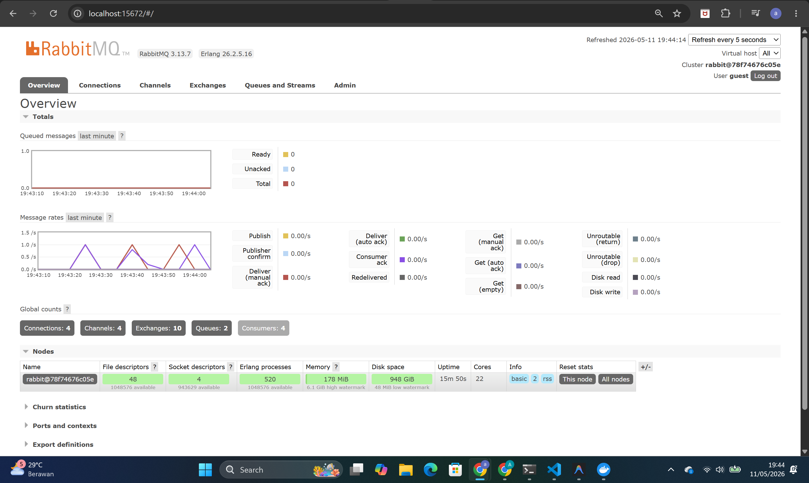

## a. What is amqp?
AMQP itu adalah singkatan dari Advanced Message Queuing Protocol.

Itu adalah protokol komunikasi yg dipakai utk mengirim dan menerima pesan lewat message broker, seperti RabbitMQ. Jadi, amqp dipakai supaya aplikasi publisher dan subscriber bisa saling bertukar pesan secara terstruktur dan asynchronous.

## b. What does it mean? `guest:guest@localhost:5672`, what is the first guest, and what is the second guest, and what is localhost:5672 is for?
Bagian itu adalah connection string utk menghubungkan aplikasi ke RabbitMQ.

Artinya:
- guest yg pertama = username
- guest yg kedua = password
- localhost = alamat server RabbitMQ yg dijalankan di komputer lokal
- 5672 = port default AMQP yg dipakai RabbitMQ

Jadi format lengkapnya dipakai utk login ke RabbitMQ lokal dengan username guest dan password guest lewat port 5672.

# Simulation slow subscriber

## c. Why is the total queue number like that?
Karena angka total queue itu ngikutin kondisi RabbitMQ yg lagi jalan pas itu. Jadi kalau queue atau message yg masih antri banyak, angkanya bakal naik. Kalau subscriber jalan terus dan message langsung diproses, totalnya bisa kecil atau bahkan 0.

Di laptopku, angkanya beda sama contoh di modul karena aku jalanin ulang service nya sendiri dan queue/message yg tersisa juga beda. Jadi intinya memang normal kalau hasilnya gak persis sama, yg penting RabbitMQ nya konek dan message bisa masuk lalu diproses.

# Reflection and Running at least three subscribers

## Reflection
Jadi aku nyoba jalankan minimal 3 instance subscriber di mesin lokal (pakai 3 container). Trus aku jalankan publisher beberapa kali dgn cepat, hasilnya RabbitMQ membagi pesan ke ketiga subscriber, jadi antrian (queue) cepat berkurang dan chartnya nunjukin spike lalu turun.

Kenapa bisa gitu? krn ada banyak consumer yang siap ambil pesan, load dibagi rata. Kalau cuma 1 subscriber, semua message bakal nunggu dan antrian terlihat lebih tinggi. Itu normal dan nunjukin benefit arsitektur event-driven: kita bisa scale consumer kalau throughput butuh naik.

## Bonus
Dari eksplorasi modul ini, aku juga jadi makin paham soal kelebihan lain pakai message broker kayak RabbitMQ buat arsitektur microservices. Ternyata dengan adanya antrian (queue), sistem kita jadi jauh lebih reliable dan fault-tolerant. Misalnya nih, kalau tiba2 subscriber nya itu mati atau lagi down sebentar, message dari publisher gak bakal hilang karena disimpen dengan aman di antrian RabbitMQ. Nanti pas subscriber nya nyala lagi, dia bakal langsung narik dan lanjut memproses message yang sempet tertunda tadi. 

Ini ngebantu banget buat mastiin gk ada data loss dan bikin interaksi antar service bener-bener loosely coupled (gak harus nunggu satu sama lain secara sinkron). Ditambah lagi karena implementasinya pakai Rust, kita dapet benefit ekstra di sisi performance dan memory safety buat nanganin event-driven architecture yg butuh kecepatan tinggi kayak gini